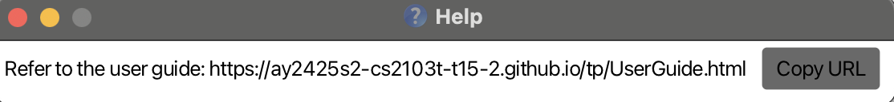
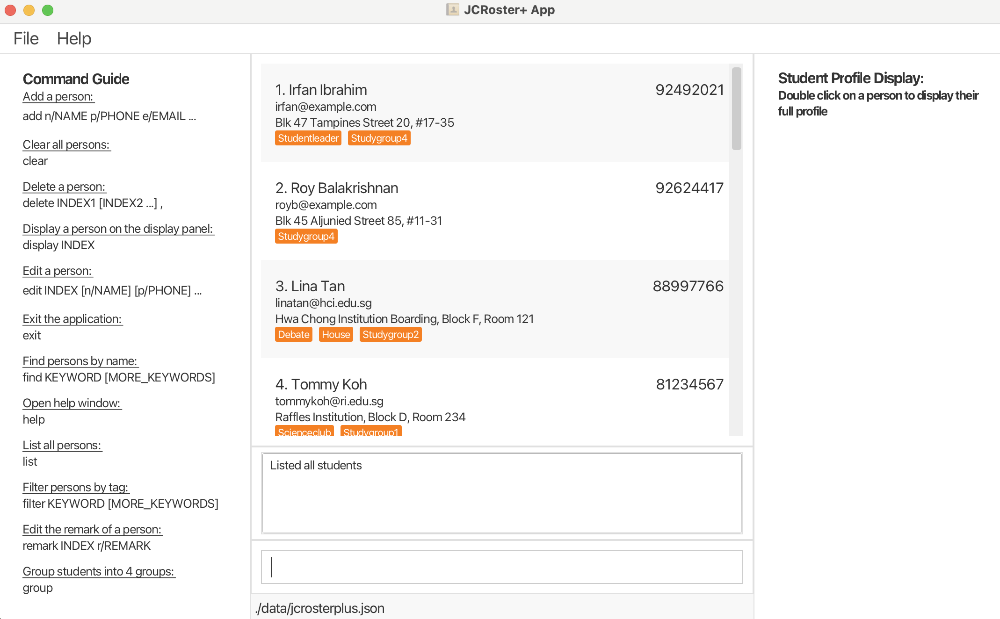
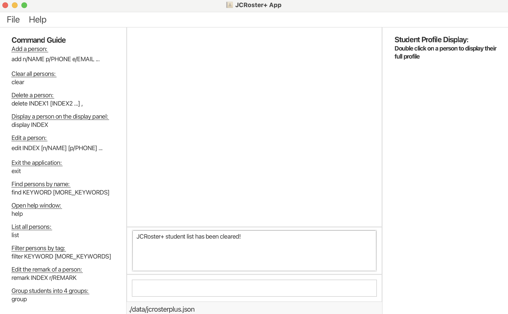
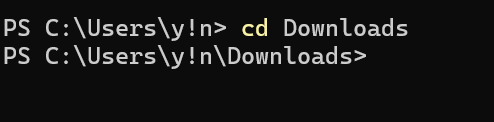

# JCRoster+ User Guide

JCRoster+ is a **desktop app for managing student contacts and details, optimized for use via a  Command Line Interface** (CLI) while still having the benefits of a Graphical User Interface (GUI). If you can type fast, JCRoster+ can get your homeroom teacher tasks done faster than traditional GUI apps.

<!-- * Table of Contents -->
<page-nav-print />

--------------------------------------------------------------------------------------------------------------------

## Quick start

1. Ensure you have Java `17` or above installed in your Computer. 
   **Mac users:** Ensure you have the precise JDK version prescribed [here](https://se-education.org/guides/tutorials/javaInstallationMac.html).

2. Download the latest `.jar` file from [AY2425S2-CS2103T-T15-2/tp/releases](https://github.com/AY2425S2-CS2103T-T15-2/tp/releases).

3. Move the file to the folder you want to use as the _home folder_ for JCRoster+.
 
<box type="tip" seamless>

**Important:** It is recommended to put the file in a new empty folder as the application will create a `data` folder in the home folder to store the data.

</box>

4. Open a command terminal (*powershell for windows, terminal for Mac*), `cd` into the folder you put the jar file in, (Refer to [Tech support](#tech-support) for using `cd` command) and use the `java -jar jcroster+.jar` command to run the application.  A GUI similar to the image below should appear in a few seconds. Note how the app contains some sample data.

 

    

 

5. Type the command in the command box and press Enter to execute it. e.g. typing **`help`** and pressing Enter will open the help window. Some example commands you can try:

   * `list` : Lists all students.

   * `add n/John Doe p/98765432 e/johnd@example.com a/John street block 123, #01-01 g/Maths:A, Geography:B, History:B, Economics:A, Chemistry:C, Biology:A` : Adds a student named `John Doe` to the JCRoster+.

   * `delete 3` : Deletes the 3rd student shown in the current list.

   * `clear` : Deletes all students.

   * `exit` : Exits the app.

6. Refer to the [Features](#features) below for details of each command.

--------------------------------------------------------------------------------------------------------------------

## Features

<box type="info" seamless>

**Notes about the command format:** 

* Words in `UPPER_CASE` are the parameters to be supplied by the user. 
  e.g. in `add n/NAME`, `NAME` is a parameter which can be used as `add n/John Doe`.

* Items in square brackets are optional. 
  e.g `n/NAME [t/TAG]` can be used as `n/John Doe t/friend` or as `n/John Doe`.

* Items with `…`​ after them can be used multiple times. 
  e.g. `[t/TAG]…​` can be used as ` ` (i.e. 0 times), `t/friend`, `t/friend t/family` etc.

* Parameters can be in any order. 
  e.g. if the command specifies `n/NAME p/PHONE_NUMBER`, `p/PHONE_NUMBER n/NAME` is also acceptable.

* Extraneous parameters for commands that do not take in parameters (such as `help`, `list`, `exit` and `clear`) will be ignored. 
  e.g. if the command specifies `help 123`, it will be interpreted as `help`.

* The display list is reset to show all students after any command is run.

* If you are using a PDF version of this document, be careful when copying and pasting commands that span multiple lines as space characters surrounding line-breaks may be omitted when copied over to the application.
</box>

### Viewing Help : `help`

Displays a help link to the User Guide.

Format: `help`

 

     

 

Copy the URL and open in a browser to view the full user guide.

### Adding a Student : `add`

Adds a student to JCRoster+.

Format: `add n/NAME p/PHONE_NUMBER e/EMAIL a/ADDRESS g/SUBJECT1:GRADE, SUBJECT2:GRADE, SUBJECT3:GRADE, SUBJECT4:GRADE SUBJECT5:GRADE, SUBJECT6:GRADE [t/TAG]…​`

* Names are case-insensitive and are formatted to capitalise the first letter of the name.

<box type="tip" seamless>

**Tip:** Tags are optional, a student can have any number of tags (including 0), 

**Note:** Use **single-word** tags only, eg: `t/friend` and not `t/friend of John Doe`.

</box>

<box type="warning" seamless>

**Tip:** There is duplication detection for students added, if the command result shows warnings such as the one below:

`Warning: It is likely that this student already exists in the JCRoster+ student list. We will add anyways, but please double check. You may want to use the edit command or delete command instead.`

This means that the student you are trying to add (maybe) already exists in the JCRoster+. 
Please check the list of students to see if the student you are trying to add already exists. If it does, you can use the `edit` command to edit the student instead of adding a new one.

</box>

**Note:** Student's subject can actually be set to any strings. You may want to double check the subject names you are entering. The system will not check if the subject names are valid or not.

Examples:
* `add n/John Doe p/98765432 e/johnd@example.com a/John street, block 123, #01-01 g/Maths:A, Geography:B, History:B, Economics:A, Chemistry:C, Biology:A`

 

  <figure style="text-align: center;">
    
    <figcaption><em>Before Add Command</em></figcaption>
  </figure>
  <figure style="text-align: center;">
    
    <figcaption><em>After Add Command</em></figcaption>
  </figure>

 

### Listing All Students : `list`

Shows a list of all students in the JCRoster+.

Format: `list`

 

  <figure style="text-align: center;">
    
    <figcaption><em>List Command</em></figcaption>
  </figure>

 

### Displaying a Student's Details : `display`

Displays all contact details, grades and tags of a student in the right panel of the JCRoster+ GUI.

Format: `display INDEX`

* Displays the student at the specified index in the displayed student list.
* You can only display one student at a time, only one index can be passed into the display command.
* The index **must be a positive integer** 1, 2, 3, ...
* After updating any of the student's details, re-run the display command to see the updated details!

<box type="tip" seamless>

**Tip:** Double-clicking on a student in the list also calls the display command!

</box>

Examples:

* `display 1` displays the details of the 1st student in the list.

 

  <figure style="text-align: center;">
    
    <figcaption><em>Before Display Command</em></figcaption>
  </figure>
  <figure style="text-align: center;">
    
    <figcaption><em>After Display Command</em></figcaption>
  </figure>

 

### Editing a Student : `edit`

Edits an existing student in the JCRoster+.

Format: `edit INDEX [n/NAME] [p/PHONE] [e/EMAIL] [a/ADDRESS] [g/SUBJECT1:GRADE, ...SUBJECT6:GRADE] [t/TAG]…​`

* Edits the student at the specified `INDEX`. The index refers to the index number shown in the displayed student list. The index **must be a positive integer** 1, 2, 3, …​
* At least one of the optional fields must be provided.
* Existing values will be updated to the input values provided.
* When editing tags, all existing tags of the student will be removed i.e adding of tags is not cumulative.
* You can remove all of a student’s tags by typing `t/` without
    specifying any tags after it.
* To edit the student’s grades, you must specify all 6 subjects and their grades. The system will not check if the subject names are valid or not.

Examples:
*  `edit 1 p/91234567 e/johndoe@example.com` edits the phone number and email address of the 1st student to be `91234567` and `johndoe@example.com` respectively.
*  `edit 2 n/Betsy Crower t/` Edits the name of the 2nd student to be `Betsy Crower` and removes all existing tags.
* `edit 2 g/Maths:A, Geography:B, History:A, Economics:A, Chemistry:C, Biology:A` edits the subjects/grades of the 2nd student to be `Maths:A, Geography:B, History:A, Economics:A, Chemistry:C, Biology:A`.
 

  <figure style="text-align: center;">
    
    <figcaption><em>Before Edit Command</em></figcaption>
  </figure>
  <figure style="text-align: center;">
    
    <figcaption><em>After Edit Command</em></figcaption>
  </figure>

 

### Locating Students by Name: `find`

Find students whose names contain any of the given keywords.

Format: `find KEYWORD [MORE_KEYWORDS]`

* The search is case-insensitive. e.g `hans` will match `Hans`
* The order of the keywords does not matter. e.g. `Hans Bo` will match `Bo Hans`
* Only the name is searched.
* Non-full words will still be matched e.g. `Han` will match `Hans`
* Students matching at least one keyword will be returned.
  e.g. `Hans Bo` will return `Hans Gruber`, `Bo Yang`

Examples:
* `find John` returns `john` and `John Doe`
* `find alex david` returns `Alex Yeoh` and `David Li`

 

  <figure style="text-align: center;">
    
    <figcaption><em>Before Find Command</em></figcaption>
  </figure>
  <figure style="text-align: center;">
    
    <figcaption><em>After Find Command</em></figcaption>
  </figure>

 

### Deleting Students : `delete`

Deletes the specified students from JCRoster+.

Format: `delete INDEX1 INDEX2 ... (up to 10 indices)`

* Deletes the students at the specified indices.
* The index refers to the index number shown in the displayed student list.
* The index **must be a positive integer** 1, 2, 3, …​

Examples:
* `delete 1` deletes the 1st student shown in the **currently displayed** list.
* `delete 2 3` deletes the 2nd and 3rd students shown in the **currently displayed** list.
* `list` followed by `delete 2` deletes the 2nd student in the JCRoster+ **currently displayed** list. 
* `find Betsy` followed by `delete 1` deletes the 1st student in the results of the `find` command.

 

  <figure style="text-align: center;">
    
    <figcaption><em>Before Delete Command</em></figcaption>
  </figure>
  <figure style="text-align: center;">
    
    <figcaption><em>After Delete Command</em></figcaption>
  </figure>

 

### Optional Remarks for Students : `remark`

Allows for adding, editing or removing remarks of a student.

Format: `remark INDEX r/REMARK`

Examples:
* `remark 2 r/` removes all remarks of the 2nd student in the **currently displayed** list.
* `remark 2 r/Needs follow-up on project deadline` adds a remark to the 2nd student in the **currently displayed** list.
* `remark 2 r/Completed project` edits the remark of the 2nd student in the **currently displayed** list.

 

  <figure style="text-align: center;">
    
    <figcaption><em>Before Remark Command</em></figcaption>
  </figure>
  <figure style="text-align: center;">
    
    <figcaption><em>After Remark Command</em></figcaption>
  </figure>

 

### Group Students into 4 Groups : `group`

Groups students into 4 study groups based on their grades. Their study group will then be displayed as a tag, eg: `Studygroup1`

Format: `group`

* The algorithm sorts students by grades and assigns them to groups in a zig-zag pattern:

<box type="tip" seamless>

**How does `group` work:** The first student (lowest grades) goes into Group 1, the second into Group 2, the third into Group 3, the forth into Group 4, the fifth back to Group 4, the sixth into group 3, and so on. This ensures a fair and balanced mix of students in each group.

</box>

* The system will automatically recalculate and reassign study groups (i.e. their `Studygroup` tags will be updated) to maintain balance and fairness in these 2 cases:
  * Deleting any student
  * Editing any student's grade

<box type="tip" seamless>

**Tip:** Manually edit a student's study group by editing their tags.

</box>

Examples:
* `group` groups all students into 4 study groups based on their grades.

 

  <figure style="text-align: center;">
    
    <figcaption><em>Before Group Command</em></figcaption>
  </figure>
  <figure style="text-align: center;">
    
    <figcaption><em>After Group Command</em></figcaption>
  </figure>

 

### Advanced Tag-Based Filtering : `filter`

Users can filter students based on multiple tags. Tags include study groups, and any other unique tags that have been added to students.

Format: `filter KEYWORD [MORE KEYWORDS]`

Examples:
* `filter student` filters all students with `student` tag.
* `filter Studygroup1` filters all students with `StudyGroup1` tag.
* The search is case-insensitive. e.g `studygroup1` will match `Studygroup1`
* Non-full words will still be matched e.g. `friend` will match `friends`
* Students with a tag matching at least one keyword will be returned. e.g. `filter student scienceclub` will return all students with either `student` or `scienceclub` tags.

<box type="tip" seamless>

**Tip:** Quickly find the students of a specific study group by using `filter studygroup#` where '#' is a number from 1 to 4.

</box>

 

  <figure style="text-align: center;">
    
    <figcaption><em>Before Filter Command</em></figcaption>
  </figure>
  <figure style="text-align: center;">
    
    <figcaption><em>After Filter Command</em></figcaption>
  </figure>

 

### Clearing All Entries : `clear`

Clears all students entries from the JCRoster+ app. 

<box type="warning" seamless>

**Note:** Use with caution, as this action is irreversible!

</box>

Format: `clear`

 

  <figure style="text-align: center;">
    
    <figcaption><em>Before Clear Command</em></figcaption>
  </figure>
  <figure style="text-align: center;">
    
    <figcaption><em>After Clear Command</em></figcaption>
  </figure>

 

### Exiting The Program : `exit`

Exits the program.

Format: `exit`

 

### Saving Data

JCRoster+ data are saved in the hard disk automatically after any command that changes the data. There is no need to save manually.

### Editing the data file

JCRoster+ data are saved automatically as a JSON file `[JAR file location]/data/jcrosterplus.json`. Advanced users are welcome to update data directly by editing that data file.

[//]: # (<box type="warning" seamless>)

**Caution:**
If your changes to the data file makes its format invalid, JCRoster+ will discard all data and start with an empty data file at the next run.  Hence, it is recommended to take a backup of the file before editing it. 
Furthermore, certain edits can cause the JCRoster+ to behave in unexpected ways (e.g., if a value entered is outside the acceptable range). Therefore, edit the data file only if you are confident that you can update it correctly.
</box>

--------------------------------------------------------------------------------------------------------------------

## FAQ

**Q**: How do I transfer my data to another Computer? 
**A**: Install the app in the other computer and overwrite the empty data file it creates with the file that contains the data of your previous JCRoster+ home folder.

--------------------------------------------------------------------------------------------------------------------

## Known issues

1. **When using multiple screens**, if you move the application to a secondary screen, and later switch to using only the primary screen, the GUI will open off-screen. The remedy is to delete the `preferences.json` file created by the application before running the application again.
2. **If you minimize the Help Window** and then run the `help` command (or use the `Help` menu, or the keyboard shortcut `F1`) again, the original Help Window will remain minimized, and no new Help Window will appear. The remedy is to manually restore the minimized Help Window.

--------------------------------------------------------------------------------------------------------------------

## Command summary

Action     | Format, Examples
-----------|----------------------------------------------------------------------------------------------------------------------------------------------------------------------
**Add**    | `add n/NAME p/PHONE_NUMBER e/EMAIL a/ADDRESS g/SUBJECT1:GRADE, ...SUBJECT6:GRADE [t/TAG]…​`   e.g., `add n/James Ho p/22224444 e/jamesho@example.com a/123, Clementi Rd, 1234665 g/Maths:A, Geography:B, History:B, Economics:A, Chemistry:C, Biology:A t/Famliy`
**Clear**  | `clear`
**Delete** | `delete INDEX1 INDEX2...`  e.g., `delete 2 3`
**Edit**   | `edit INDEX [n/NAME] [p/PHONE_NUMBER] [e/EMAIL] [a/ADDRESS] [g/SUBJECT1:GRADE, ...SUBJECT6:GRADE] [t/TAG]…​`  e.g.,`edit 2 n/James Lee e/jameslee@example.com`
**Find**   | `find KEYWORD [MORE_KEYWORDS]`  e.g., `find James Jake`
**List**   | `list`
**Help**   | `help`
**Exit**   | `exit`
**Filter**   | `filter KEYWORD [MORE_KEYWORDS]`  e.g., `filter student tutor`
**Remark**   | `remark INDEX r/REMARK`  e.g., `remark 2 r/Completed project`
**Group**   | `group`
**Display**   | `display INDEX`  e.g., `display 2`

## Tech support
### Using `cd` command

After opening terminal, you will see a screen like this:

    

 

Type `ls` to see files in the current directory 

    

 

Type `cd [folder name] `to enter that folder 
 

For example: After `cd Downloads` The terminal should now show you that you’re inside the Downloads folder 
 

    

 

Type `cd ..` to go back to the previous folder 

##### If you dont know the path to your JAR file
1. Find your JAR file and right click on it.
2. After clicking on properties, locate the path to the file.
3. Copy the path and use it in the terminal `cd [path-to-file] `to navigate to the folder where the JAR file is located.

