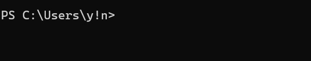

# JCRoster+ User Guide

JCRoster+ (MVP) is a **desktop app for managing student contacts and details, optimized for use via a  Line Interface** (CLI) while still having the benefits of a Graphical User Interface (GUI). If you can type fast, JCRoster+ can get your homeroom teacher tasks done faster than traditional GUI apps.

<!-- * Table of Contents -->
<page-nav-print />

--------------------------------------------------------------------------------------------------------------------

## Quick start

1. Ensure you have Java `17` or above installed in your Computer. 
   **Mac users:** Ensure you have the precise JDK version prescribed [here](https://se-education.org/guides/tutorials/javaInstallationMac.html).

1. Download the latest `.jar` file from [AY2425S2-CS2103T-T15-2/tp/releases](https://github.com/AY2425S2-CS2103T-T15-2/tp/releases).

1. Move the file to the folder you want to use as the _home folder_ for your JCRoster+. 
   **Important:**   It is recommended to put the file in a new empty folder as
   The application will create a `data` folder in the home folder to store the data.

1. Open a command terminal (*powershell for windows, terminal for Mac*),  
   `cd` into the folder you put the jar file in, (Refer to the [Tech_support](#Tech_support) for using `cd` command)
    and use the `java -jar jcroster+.jar` command to run the application. 
   A GUI similar to the below should appear in a few seconds. Note how the app contains some sample data. 
   

1. Type the command in the command box and press Enter to execute it. e.g. typing **`help`** and pressing Enter will open the help window. 
   Some example commands you can try:

   * `list` : Lists all students.

   * `add n/John Doe p/98765432 e/johnd@example.com a/John street block 123, #01-01 g/Maths:A, Geography:B, History:B, Economics:A, Chemistry:C, Biology:A` : Adds a student named `John Doe` to the JCRoster+.

   * `delete 3` : Deletes the 3rd student shown in the current list.

   * `clear` : Deletes all students.

   * `exit` : Exits the app.

1. Refer to the [Features](#features) below for details of each command.

--------------------------------------------------------------------------------------------------------------------

## Features

<box type="info" seamless>

**Notes about the command format:** 

* Words in `UPPER_CASE` are the parameters to be supplied by the user. 
  e.g. in `add n/NAME`, `NAME` is a parameter which can be used as `add n/John Doe`.

* Items in square brackets are optional. 
  e.g `n/NAME [t/TAG]` can be used as `n/John Doe t/friend` or as `n/John Doe`.

* Items with `…`​ after them can be used multiple times. 
  e.g. `[t/TAG]…​` can be used as ` ` (i.e. 0 times), `t/friend`, `t/friend t/family` etc.

* Parameters can be in any order. 
  e.g. if the command specifies `n/NAME p/PHONE_NUMBER`, `p/PHONE_NUMBER n/NAME` is also acceptable.

* Extraneous parameters for commands that do not take in parameters (such as `help`, `list`, `exit` and `clear`) will be ignored. 
  e.g. if the command specifies `help 123`, it will be interpreted as `help`.

* If you are using a PDF version of this document, be careful when copying and pasting commands that span multiple lines as space characters surrounding line-breaks may be omitted when copied over to the application.
</box>

### Viewing help : `help`

Displays a link to the User Guide.

Format: `help`

Copy the URL and open in a browser to view the full user guide.

### Adding a person: `add`

Adds a person to the JCRoster+.

Format: `add n/NAME p/PHONE_NUMBER e/EMAIL a/ADDRESS g/SUBJECT1:GRADE, ...SUBJECT6:GRADE [t/TAG]…​`

<box type="tip" seamless>

**Tip:** A student can have any number of tags (including 0)

**Note:** Use single-word tags only.

</box>

Examples:
* `add n/John Doe p/98765432 e/johnd@example.com a/John street, block 123, #01-01 g/Maths:A, Geography:B, History:B, Economics:A, Chemistry:C, Biology:A`

### Listing all students : `list`

Shows a list of all students in the JCRoster+.

Format: `list`

### Editing a student : `edit`

Edits an existing student in the JCRoster+.

Format: `edit INDEX [n/NAME] [p/PHONE] [e/EMAIL] [a/ADDRESS] [g/SUBJECT1:GRADE, ...SUBJECT6:GRADE] [t/TAG]…​`

* Edits the student at the specified `INDEX`. The index refers to the index number shown in the displayed student list. The index **must be a positive integer** 1, 2, 3, …​
* At least one of the optional fields must be provided.
* Existing values will be updated to the input values.
* When editing tags, the existing tags of the student will be removed i.e adding of tags is not cumulative.
* You can remove all the person’s tags by typing `t/` without
    specifying any tags after it.

Examples:
*  `edit 1 p/91234567 e/johndoe@example.com` Edits the phone number and email address of the 1st student to be `91234567` and `johndoe@example.com` respectively.
*  `edit 2 n/Betsy Crower t/` Edits the name of the 2nd student to be `Betsy Crower` and clears all existing tags.

### Locating students by name: `find`

Finds students whose names contain any of the given keywords.

Format: `find KEYWORD [MORE_KEYWORDS]`

* The search is case-insensitive. e.g `hans` will match `Hans`
* The order of the keywords does not matter. e.g. `Hans Bo` will match `Bo Hans`
* Only the name is searched.
* Non-full words will still be matched e.g. `Han` will match `Hans`
* Persons matching at least one keyword will be returned (i.e. `OR` search).
  e.g. `Hans Bo` will return `Hans Gruber`, `Bo Yang`

Examples:
* `find John` returns `john` and `John Doe`
* `find alex david` returns `Alex Yeoh`, `David Li` 
  

### Deleting students : `delete`

Deletes the specified students from the JCRoster+.

Format: `delete INDEX1 INDEX2 ... (up to 10 indices)`

* Deletes the students at the specified indices.
* The index refers to the index number shown in the displayed person list.
* The index **must be a positive integer** 1, 2, 3, …​

Examples:
* `list` followed by `delete 2` deletes the 2nd student in the JCRoster+.
* `find Betsy` followed by `delete 1` deletes the 1st student in the results of the `find` command.

### Optional remarks for students : `remark`

Allows adding or editing remarks for a person

Format: `remark INDEX r/REMARK`

Examples:
* `remark 2 r/Needs follow-up on project deadline` adds a remark to 2nd student.
* `remark 2 r/Completed project` edits the remark of 2nd student.

### Group students into 4 groups: `group`

Groups students into 4 study groups based on their grades. Their study group will then be displayed as a tag.

Format: `group`

Examples:
* `group` groups all students into 4 study groups based on their grades.

**Note:** The algorithm sorts students by grades and assigns them to groups in a zig-zag pattern:  The first student(weakest) goes into Group 1, the second into Group 2, the third into Group 3, the forth into Group 4, the fifth back to Group 4, the sixth into group 3, and so on. 
This ensures a balanced mix of students in each group.

**Tip:** Editing any student's grade will cause the system to automatically recalculate and reassign study groups to maintain balance and fairness.

**Tip:** You can manually edit a student's study group by editing their tags.

### Advanced Tag-Based Filtering : `filter`

Users can filter students based on multiple tags.

Format: `filter KEYWORD [MORE_KEYWORDS]`

Examples:
* `filter student tutor` filters all students with `student tutor` tag.
* Non-full words will still be matched e.g. `friend` will match `friends`

### Clearing all entries : `clear`

Clears all entries from the JCRoster+.

Format: `clear`

### Exiting the program : `exit`

Exits the program.

Format: `exit`

### Saving the data

JCRoster+ data are saved in the hard disk automatically after any command that changes the data. There is no need to save manually.

### Editing the data file

JCRoster+ data are saved automatically as a JSON file `[JAR file location]/data/addressbook.json`. Advanced users are welcome to update data directly by editing that data file.

<box type="warning" seamless>

**Caution:**
If your changes to the data file makes its format invalid, JCRoster+ will discard all data and start with an empty data file at the next run.  Hence, it is recommended to take a backup of the file before editing it. 
Furthermore, certain edits can cause the JCRoster+ to behave in unexpected ways (e.g., if a value entered is outside the acceptable range). Therefore, edit the data file only if you are confident that you can update it correctly.
</box>

--------------------------------------------------------------------------------------------------------------------

## FAQ

**Q**: How do I transfer my data to another Computer? 
**A**: Install the app in the other computer and overwrite the empty data file it creates with the file that contains the data of your previous JCRoster+ home folder.

--------------------------------------------------------------------------------------------------------------------

## Known issues

1. **When using multiple screens**, if you move the application to a secondary screen, and later switch to using only the primary screen, the GUI will open off-screen. The remedy is to delete the `preferences.json` file created by the application before running the application again.
2. **If you minimize the Help Window** and then run the `help` command (or use the `Help` menu, or the keyboard shortcut `F1`) again, the original Help Window will remain minimized, and no new Help Window will appear. The remedy is to manually restore the minimized Help Window.

--------------------------------------------------------------------------------------------------------------------

## Command summary

Action     | Format, Examples
-----------|----------------------------------------------------------------------------------------------------------------------------------------------------------------------
**Add**    | `add n/NAME p/PHONE_NUMBER e/EMAIL a/ADDRESS g/SUBJECT1:GRADE, ...SUBJECT6:GRADE [t/TAG]…​`   e.g., `add n/James Ho p/22224444 e/jamesho@example.com a/123, Clementi Rd, 1234665 g/Maths:A, Geography:B, History:B, Economics:A, Chemistry:C, Biology:A t/Famliy`
**Clear**  | `clear`
**Delete** | `delete INDEX1 INDEX2...`  e.g., `delete 2 3`
**Edit**   | `edit INDEX [n/NAME] [p/PHONE_NUMBER] [e/EMAIL] [a/ADDRESS] [g/SUBJECT1:GRADE, ...SUBJECT6:GRADE] [t/TAG]…​`  e.g.,`edit 2 n/James Lee e/jameslee@example.com`
**Find**   | `find KEYWORD [MORE_KEYWORDS]`  e.g., `find James Jake`
**List**   | `list`
**Help**   | `help`
**Exit**   | `exit`
**Filter**   | `filter KEYWORD [MORE_KEYWORDS]`  e.g., `filter student tutor`
**Remark**   | `remark INDEX r/REMARK`  e.g., `remark 2 r/Completed project`
**Group**   | `group`

## Tech_support
### Using `cd` command

After opening terminal, you will see a screen like  
Type `ls` to see files in this directory  
Type `cd [folder name] `to enter that folder  
For example : 
`cd Downloads ` The terminal prompt should now show that you’re inside the Downloads folder  
 
Type `cd ..` to go back to previous folder 

##### If you dont know the path to your JAR file
Find your JAR file and right click on it, 
After clicking on properties, locate the path to the file,  
Copy it and use it in the terminal `cd [path/to/file] `to navigate to the folder where the JAR file is located

